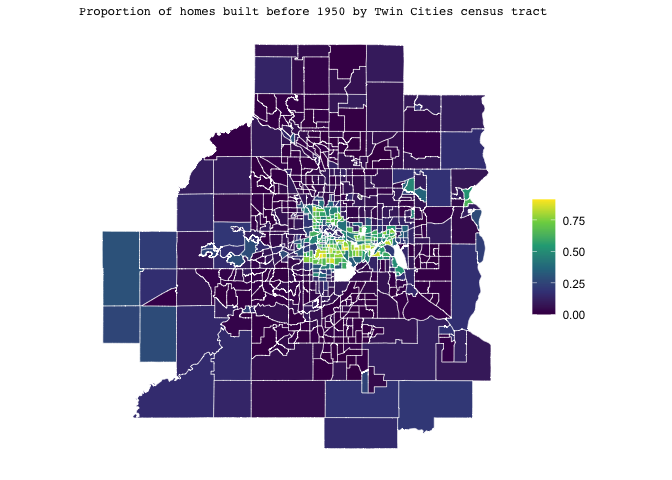
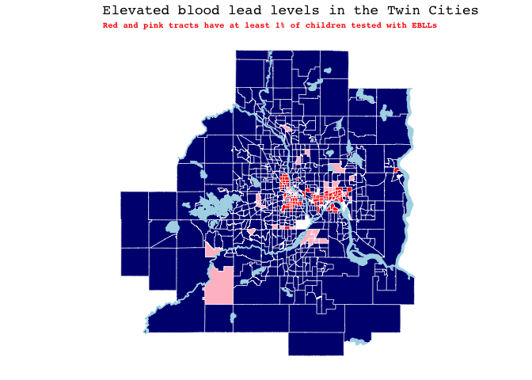

A Spatial Analysis of Elevated Blood Lead Levels in the Twin Cities
Metropolitan Region
================
Erin Franke and Nicholas Di
May 6, 2022

    ## Reading layer `LakesAndRivers' from data source 
    ##   `/Users/erinfranke/Desktop/MACStats/Correlated Data/nick-erin-capstone/DataShapefiles/shp_water_lakes_rivers' 
    ##   using driver `ESRI Shapefile'
    ## Simple feature collection with 2313 features and 8 fields
    ## Geometry type: MULTIPOLYGON
    ## Dimension:     XY
    ## Bounding box:  xmin: 419538.6 ymin: 4922700 xmax: 522665 ymax: 5029945
    ## Projected CRS: NAD83 / UTM zone 15N

    ## Reading layer `tl_2019_27_prisecroads' from data source 
    ##   `/Users/erinfranke/Desktop/MACStats/Correlated Data/nick-erin-capstone/DataShapefiles/tl_2019_27_prisecroads' 
    ##   using driver `ESRI Shapefile'
    ## Simple feature collection with 4309 features and 4 fields
    ## Geometry type: LINESTRING
    ## Dimension:     XY
    ## Bounding box:  xmin: -97.23724 ymin: 43.4995 xmax: -89.58524 ymax: 49.00066
    ## Geodetic CRS:  NAD83

# Introduction

When raising a child, parents go through lots of stress to keep their
children safe and healthy. From using car seats to getting children
vaccinated to working on speech and mobility development and beyond,
there is a lot to think about. But one thing that may be overlooked in
providing safe and healthy environment for a child is lead. Lead in
paint, soil, air, or water is invisible to the naked eye and has no
smell (“Prevent Children’s Exposure to Lead” 2021). However, children
can be exposed to lead in a variety of manners, including swallowing
house dust or soil contaminated by lead paint or drinking water
delivered through lead-based pipes, faucets, and plumbing fixtures.
Exposure to this hidden element can seriously harm a child’s health,
including damage to the child’s brain and nervous system, slowed growth
and development, as well as learning, hearing, speech, and behavior
problems (“Prevent Children’s Exposure to Lead” 2021). If exposed to
especially high levels of lead, children can face a brain condition
known as encephalopathy, severe neurological damage, coma, and even
death (“Annual Elevated Blood Lead Levels” 2020). Thus, without a
question it is crucial to keep lead exposure to a minimum when raising a
child.

In this analysis, we analyzed elevated blood lead levels in the
**7-county Twin Cities metropolitan area** using public data provided by
the **Minnesota Department of Health** over the period of 2015-2019
(Health, n.d.). To protect the privacy of individuals, the smallest
granularity we were able to obtain this data was on the census tract
level, meaning for each of the 691 census tracts in the Twin Cities
metropolitan area we obtained information on how many children were
tested and how many of those tests resulted in elevated blood lead
levels. To have **elevated blood lead levels (EBLL)** means that a child
has a confirmed result **at or above 5 micrograms of lead per deciliter
of blood (mcg/dL)** (“Annual Elevated Blood Lead Levels” 2020). Children
under 6 years of age are tested. The Minnesota Department of Health
idenifies children living in the Minneapolis and Saint Paul city limits
as children at a higher risk for lead exposure and recommends these
children to receive blood lead testing at 1 and 2 years of age. This
recommendation is warranted given that in 2019, between 1-2% of children
in Minneapolis or St. Paul had an EBLL, which is double the statewide
average and higher than any other region of Minnesota (“Annual Elevated
Blood Lead Levels” 2020). Interestingly, the MDH has found children
living in the Metro area but not living in the cities of Minneapolis or
St. Paul are at a lower risk of lead exposure than the Greater Minnesota
(non-Metro) are. Only about 0.3% of these children have high EBLL levels
whereas about 0.8% of children living in MN outside the metro area have
high EBLL levels. As a result, to best explore this contrast between
Minneapolis-Saint Paul and the suburban region, this project will solely
focus on EBLL data from the 7 county Twin Cities metro area. This region
is shown in navy on the road map of Minnesota below.

<!-- -->

# Research Goal

Keeping the health consequences of lead exposure to children in the
front of our minds, our research focuses on investigating what is
correlated with a census tract having a noticeably high proportion of
children testing with elevated blood lead levels. We defined a tract to
be a “high lead tract” if at least 1% of the tests in the tract resulted
in elevated blood lead levels (meaning 5+ mcg lead/dL). This left us
with 106 “high lead” tracts and 585 “safe” tracts. The location of these
“high lead” tracts in the Twin Cities metropolitan area can be seen
below. It is clear that the majority of them fall in the
Minneapolis-Saint Paul city limits.

<!-- -->

The reason why this research question is important is because
understanding what is correlated with tracts having high lead levels can
help the Minnesota Department of Health, organizations, and families
protect children from lead exposure. For example, it wouldn’t be
unreasonable to expect tracts with older homes to have higher lead
levels, as these homes are more likely to have been built when science
did not know the harms of lead pipes and paint. On March 28, 2022, Saint
Paul Mayor Melvin Carter announced a $14.5 million American Rescue Plan
investment to remove thousands of lead pipes across the city (n.d.). If
home age appears a strong indicator of high lead levels, identifying
tracts with old homes, high lead levels, and lots of young children can
alert the city to replace their pipes first. In our research we also
might search for a relationship between testing, income, and lead
levels. If we are to find certain income groups getting tested more or
less than others holding other variables constant, we can shed light on
that and advocate for resources to get specific tracts the testing they
need and deserve given their exposure.

To help us understand what is correlated with a tract being “high lead,”
we will need more than just the information provided by the MDH of tract
lead levels. Using the **tidycensus** (Walker and Herman 2022) package
in R, we can access a plethora of information on each census tract
including its estimated mean age, mean income, population, proportion of
family households, home age, and so much more. We begin by exploring the
relationship between many of these variables and testing as well as
EBLLs.

# Exploratory Data Analysis

## Estimated Home Age and EBLLs

One of the first variables we decided to explore was estimated home age.
Using the tidycensus package, we were able to access the number of
residences in each census tract built prior to 1950, between 1950-1959,
1960-1969, etc. We made these variables proportions by dividing the
number of homes built in each time period by the total number of homes
in the census tract. Most revealing was the proportion of homes built
prior to 1950 - as seen in the map below, the Minneapolis-Saint Paul
city limits are largely composed of these older homes while the tracts
on the outskirts of the city have few very homes built before 1950.

<!-- -->

Given this visualization and our knowledge of history, it is clear that
home age likely plays a strong role in lead exposure in children. But it
can’t be the only factor. In the map below, we again identify tracts
with at least 1% of tests registering with elevated blood lead levels.
These tracts are colored red and pink, though *in the pink tracts less
than 25% of homes were built before 1950*. We see these pink tracts
generally are located outside the MSP city limits in more recently
developed suburban areas.

<!-- -->

Comparing these pink tracts we have denoted as “high lead” tracts that
contain less than 25% of homes built before 1950 to tracts we have
denoted as having safe lead levels, there are a few things to notice.
Our first thought was that perhaps these pink tracts were still
significantly older than the safe lead level tracks and were just built
largely in the 1960s and 70s. Lead-based paint and lead-contaminated
dust are the most common sources of lead poisoning, and paint containing
lead was not banned in the United States until 1978 (“Common Sources of
Lead Poisoning,” n.d.). Therefore, any home built prior to 1978 could
serve as an exposure threat to children. It ended up that on average
56.1% percent of the homes in the pink tracts were built before 1979
compared to 54.8% of homes in the safe lead tracts. With such a small
difference, there has to be something else correlated with children
testing for EBLLs in particular tracts. Looking into other variables, we
found the pink high lead tracts have a slightly higher population
density at about 2 people/1000 m2 than the safe lead tracts
at 1.4 people/1000 m2. Additionally, these pink high lead
tracts have an estimated median income of $63,431, whereas the safe lead
tracts have an estimated median income of almost $87,661. Lead exposure
can also come through occupation (people exposed to lead through jobs in
fields such as auto repair, mining, pipe fitting, battery manufacturing,
painting, and construction can bring it home on their clothing), soil,
pottery, herbal and folk remedies, the ingredient tamarind in candy, and
cosmetics (“Lead Poisoning” 2022). Given the significant difference in
median income between the pink high lead tracts and the safe lead
tracts, it is possible that residents from the pink high lead tracts
live a different lifestyle than residents in the safe lead tracts that
causes them to be exposed to lead at a higher rate. While it’s clear we
can’t fully solve this mystery given the data we have, the
identification of these somewhat unexpected “high lead” tracts is
crucial as it can help direct resources and information toward these
tracts in order to reduce lead exposure.

## Who is getting tested?

# Modeling the percent of children by census tract with EBLLs

Thus far, we have developed a model to predict whether or not a census
tract will have at least 1% of tests return with an indication of EBLLs.
But its important to acknowledge that not all census tracts that we have
denoted as “high lead” have the same proportion of tests indicating
EBLLs. For the 106 “high lead” tracts, the distribution of the
proportion of tests indicating EBLLs is shown below.

<!-- -->

In order to better understand this distribution and what is correlated
with certain tracts having a higher percentage of tests with EBLLs than
others, we will build a model for this percentage using solely the 106
“high lead” tracts. Similar to our logistic model building process to
predict whether or not a tract is “high lead,” we will begin with a
LASSO regression model. Variables that remain in the model after the
shrinkage process can be thought of as most important at helping us
identify why certain tracts have a higher percentage of tests with EBLLs
than others.

Using 10-fold cross validation on our 106 census tracts, the LASSO
modeling process identified tract population, the proportion of homes
built between 1950 and 1969, the proportion of homes built before 1950,
and the estimated mean receipt of supplemental security income (SSI) for
households with children under 18 as the most important predictors of
percentage of tests with EBLLs. Interestingly, population and amount of
SSI both showed a negative relationship with percentage of tests with
EBLLs, meaning more highly populated tracts tend to have a lower
proportion of tests with EBLLs holding other variables constant.
Additionally, tracts receiving more SSI tend to have a lower proportion
of tests with EBLLs holding other variables constant. These
relationships are shown in the plots below.

The reasoning for this phenomena could be that such higher populated and
impoverished tracts are viewed “higher risk” for lead exposure and have
received greater resources to prevent it thus far.

Now that we have our model, we can evaluate it. Looking first at our
prediction errors, the model appears relatively solid with a mean
estimated error of 1.5%. While this is good news, our model must also
have residuals that do not have spatial autocorrelation. Spatial
autocorrelation means residuals in one census tract are related to the
residuals in the census tracts around it, which is problematic because
we violate the assumption of independence of residuals and jeopardize
the validity of hypothesis tests. We can test for spatial
autocorrelation with something called the Moran’s I test. In order to
run the Moran’s I test, we must decide in what way we want to define
census tracts as “close.” In other words, we must define a
**neighborhood structure**. There are many options when defining a
neighborhood structure. We can define tracts as neighbors if they touch
at all, even just at a on point such as a corner. This is called the
Queen neighborhood structure. Another option is the Rook neighborhood
structure, which defines tracts as neighbors if they share an edge (more
than just a corner). Neighbors can also be defined using distance. The
KNN method calculates the distance between the centers (or centroids) of
each census tract, and then defines a neighborhood based on K nearest
tracts, distanced based on the centers (Heggeseth 2022). Because we are
only looking at census tracts with high lead levels, some tracts do not
touch and thus we will use the KNN structure with 4 neighbors. 4
neighbors gives a nice balance between not having too many neighbors
(which makes census tracts almost always correlated) and not having too
few neighbors, making it harder to pick up on spatial correlation. The
KNN(4) structure is shown below.

<!-- -->

    ## 
    ##  Moran I test under randomisation
    ## 
    ## data:  lasso_results$resid  
    ## weights: Wb    
    ## 
    ## Moran I statistic standard deviate = 4.1422, p-value = 3.44e-05
    ## alternative hypothesis: two.sided
    ## sample estimates:
    ## Moran I statistic       Expectation          Variance 
    ##       0.236081076      -0.009523810       0.003515754

Using the Moran’s I test with the KNN(4) structure shown above, there is
very strong evidence to reject our null hypothesis of no spatial
correlation between neighboring tracts. We thus conclude that census
tracts closer together tend to have similar percentages of tests with
EBLLs than census tracts further apart. Given this, we will need to use
a model that accounts for this spatial autocorrelation. Two models that
can potentially accomplish this are the **simultaneous autoregressive
model (SAR)** and the **conditional autoregressive model (CAR)**. These
models are fit in a similar way to an ordinary least squares model as we
predict percent of tests with EBLLs using our selected variables,
however, we add a component to the model that allows us to use
surrounding neighborhood values at varying weights to estimate
percentage of tests with EBLLs for each tract. After fitting both a CAR
and SAR model using the four variables selected by LASSO and the KNN(4)
neighborhood structure, we compared them using BIC and the Moran’s I
test. From the Moran’s I test we learned the SAR model yielded strong
evidence in support of independent residuals. This evidence was
significantly weaker for the CAR model, implying remaining spatial
autocorrelation in the residuals. The BIC (a criterion for model
selection) was also superior for the SAR model in comparison to the CAR
model, and thus we decided to proceed with the SAR structure.

# References

n.d. *Saint Paul Minnesota*.
<https://www.stpaul.gov/news/saint-paul-announces-145-million-investment-replace-lead-pipes>.

“Annual Elevated Blood Lead Levels.” 2020. *Childhood Lead Exposure:
Annual Blood Lead Levels - MN Data*.
<https://data.web.health.state.mn.us/lead_annual_level>.

“Common Sources of Lead Poisoning.” n.d. *Washington State Department of
Health*.
<https://doh.wa.gov/you-and-your-family/healthy-home/home-contaminants/lead/common-sources-lead-poisoning>.

Health, Minnesota Department of. n.d. *Childhood Lead Exposure Map: MNPH
Data Access - MN Dept. Of Health*.
<https://mndatamaps.web.health.state.mn.us/interactive/leadtract.html>.

Heggeseth, Brianna. 2022. “Correlated Data Notes.” *Brianna C.
Heggeseth*. <https://bcheggeseth.github.io/CorrelatedData/index.html>.

“Lead Poisoning.” 2022. *Mayo Clinic*. Mayo Foundation for Medical
Education; Research.
<https://www.mayoclinic.org/diseases-conditions/lead-poisoning/symptoms-causes/syc-20354717>.

“Prevent Children’s Exposure to Lead.” 2021. *Centers for Disease
Control and Prevention*. Centers for Disease Control; Prevention.
<https://www.cdc.gov/nceh/features/leadpoisoning/index.html>.

Walker, Kyle, and Matt Herman. 2022. *Tidycensus: Load US Census
Boundary and Attribute Data as ’Tidyverse’ and ’Sf’-Ready Data Frames*.
<https://walker-data.com/tidycensus/>.

