A Spatial Analysis of Elevated Blood Lead Levels in the Twin Cities
Metropolitan Region
================
Erin Franke and Nicholas Di
May 6, 2022

    ## Reading layer `LakesAndRivers' from data source 
    ##   `/Users/nicholasdi/Documents/GitHub/nick-erin-capstone/DataShapefiles/shp_water_lakes_rivers' 
    ##   using driver `ESRI Shapefile'
    ## Simple feature collection with 2313 features and 8 fields
    ## Geometry type: MULTIPOLYGON
    ## Dimension:     XY
    ## Bounding box:  xmin: 419538.6 ymin: 4922700 xmax: 522665 ymax: 5029945
    ## Projected CRS: NAD83 / UTM zone 15N

    ## Reading layer `tl_2019_27_prisecroads' from data source 
    ##   `/Users/nicholasdi/Documents/GitHub/nick-erin-capstone/DataShapefiles/tl_2019_27_prisecroads' 
    ##   using driver `ESRI Shapefile'
    ## Simple feature collection with 4309 features and 4 fields
    ## Geometry type: LINESTRING
    ## Dimension:     XY
    ## Bounding box:  xmin: -97.23724 ymin: 43.4995 xmax: -89.58524 ymax: 49.00066
    ## Geodetic CRS:  NAD83

# Introduction

When raising a child, parents go through lots of stress to keep their
children safe and healthy. From using car seats to getting children
vaccinated to working on speech and mobility development and beyond,
there is a lot to think about. But one thing that may be overlooked in
providing safe and healthy environment for a child is lead. Lead in
paint, soil, air, or water is invisible to the naked eye and has no
smell (“Prevent Children’s Exposure to Lead” 2021). However, children
can be exposed to lead in a variety of manners, including swallowing
house dust or soil contaminated by lead paint or drinking water
delivered through lead-based pipes, faucets, and plumbing fixtures.
Exposure to this hidden element can seriously harm a child’s health,
including damage to the child’s brain and nervous system, slowed growth
and development, as well as learning, hearing, speech, and behavior
problems (“Prevent Children’s Exposure to Lead” 2021). If exposed to
especially high levels of lead, children can face a brain condition
known as encephalopathy, severe neurological damage, coma, and even
death (“Annual Elevated Blood Lead Levels” 2020). Thus, without a
question it is crucial to keep lead exposure to a minimum when raising a
child.

In this analysis, we analyzed elevated blood lead levels in the
**7-county Twin Cities metropolitan area** using public data provided by
the **Minnesota Department of Health** over the period of 2015-2019
(Health, n.d.). To protect the privacy of individuals, the smallest
granularity we were able to obtain this data was on the census tract
level, meaning for each of the 691 census tracts in the Twin Cities
metropolitan area we obtained information on how many children were
tested and how many of those tests resulted in elevated blood lead
levels. To have **elevated blood lead levels (EBLL)** means that a child
has a confirmed result **at or above 5 micrograms of lead per deciliter
of blood (mcg/dL)** (“Annual Elevated Blood Lead Levels” 2020). Children
under 6 years of age are tested. The Minnesota Department of Health
idenifies children living in the Minneapolis and Saint Paul city limits
as children at a higher risk for lead exposure and recommends these
children to receive blood lead testing at 1 and 2 years of age. This
recommendation is warranted given that in 2019, between 1-2% of children
in Minneapolis or St. Paul had an EBLL, which is double the statewide
average and higher than any other region of Minnesota (“Annual Elevated
Blood Lead Levels” 2020). Interestingly, the MDH has found children
living in the Metro area but not living in the cities of Minneapolis or
St. Paul are at a lower risk of lead exposure than the Greater Minnesota
(non-Metro) are. Only about 0.3% of these children have high EBLL levels
whereas about 0.8% of children living in MN outside the metro area have
high EBLL levels. As a result, to best explore this contrast between
Minneapolis-Saint Paul and the suburban region, this project will solely
focus on EBLL data from the 7 county Twin Cities metro area. This region
is shown in navy on the road map of Minnesota below.

<!-- -->

# Research Goal

Keeping the health consequences of lead exposure to children in the
front of our minds, our research focuses on investigating what is
correlated with a census tract having a noticeably high proportion of
children testing with elevated blood lead levels. We defined a tract to
be a “high lead tract” if at least 1% of the tests in the tract resulted
in elevated blood lead levels (meaning 5+ mcg lead/dL). This left us
with 106 “high lead” tracts and 585 “safe” tracts. The location of these
“high lead” tracts in the Twin Cities metropolitan area can be seen
below. It is clear that the majority of them fall in the
Minneapolis-Saint Paul city limits.

<!-- -->

The reason why this research question is important is because
understanding what is correlated with tracts having high lead levels can
help the Minnesota Department of Health, organizations, and families
protect children from lead exposure. For example, it wouldn’t be
unreasonable to expect tracts with older homes to have higher lead
levels, as these homes are more likely to have been built when science
did not know the harms of lead pipes and paint. On March 28, 2022, Saint
Paul Mayor Melvin Carter announced a $14.5 million American Rescue Plan
investment to remove thousands of lead pipes across the city (n.d.). If
home age appears a strong indicator of high lead levels, identifying
tracts with old homes, high lead levels, and lots of young children can
alert the city to replace their pipes first. In our research we also
might search for a relationship between testing, income, and lead
levels. If we are to find certain income groups getting tested more or
less than others holding other variables constant, we can shed light on
that and advocate for resources to get specific tracts the testing they
need and deserve given their exposure.

To help us understand what is correlated with a tract being “high lead”,
we will need more than just the information provided by the MDH of tract
lead levels. Using the **tidycensus** (Walker and Herman 2022) package
in R, we can access a plethora of information on each census tract
including its estimated mean age, mean income, population, proportion of
family households, home age, and so much more. We begin by exploring the
relationship between many of these variables and testing as well as
EBLLs.

# Exploratory Data Analysis

## Estimated Home Age and EBLLs

One of the first variables we decided to explore was estimated home age.
Using the tidycensus package, we were able to access the number of
residences in each census tract built prior to 1950, between 1950-1959,
1960-1969, etc. We made these variables proportions by dividing the
number of homes built in each time period by the total number of homes
in the census tract. Most revealing was the proportion of homes built
prior to 1950 - as seen in the map below, the Minneapolis-Saint Paul
city limits are largely composed of these older homes while the tracts
on the outskirts of the city have few very homes built before 1950.

<!-- -->

Given this visualization and our knowledge of history, it is clear that
home age likely plays a strong role in lead exposure in children. But it
can’t be the only factor. In the map below, we again identify tracts
with at least 1% of tests registering with elevated blood lead levels.
These tracts are colored red and pink, though *in the pink tracts less
than 25% of homes were built before 1950*. We see these pink tracts
generally are located outside the MSP city limits in more recently
developed suburban areas.

<!-- -->

Comparing these pink tracts we have denoted as “high lead” tracts that
contain less than 25% of homes built before 1950 to tracts we have
denoted as having safe lead levels, there are a few things to notice.
Our first thought was that perhaps these pink tracts were still
significantly older than the safe lead level tracks and were just built
largely in the 1960s and 70s. Lead-based paint and lead-contaminated
dust are the most common sources of lead poisoning, and paint containing
lead was not banned in the United States until 1978 (“Common Sources of
Lead Poisoning,” n.d.). Therefore, any home built prior to 1978 could
serve as an exposure threat to children. It ended up that on average
56.1% percent of the homes in the pink tracts were built before 1979
compared to 54.8% of homes in the safe lead tracts. With such a small
difference, there has to be something else correlated with children
testing for EBLLs in particular tracts. Looking into other variables, we
found the pink high lead tracts have a slightly higher population
density at about 2 people/1000

than the safe lead tracts at 1.4 people/1000
.
Additionally, these pink high lead tracts have an estimated median
income of $63,431, whereas the safe lead tracts have an estimated median
income of almost $87,661. Lead exposure can also come through occupation
(people exposed to lead through jobs in fields such as auto repair,
mining, pipe fitting, battery manufacturing, painting, and construction
can bring it home on their clothing), soil, pottery, herbal and folk
remedies, the ingredient tamarind in candy, and cosmetics (“Lead
Poisoning” 2022). Given the significant difference in median income
between the pink high lead tracts and the safe lead tracts, it is
possible that residents from the pink high lead tracts live a different
lifestyle than residents in the safe lead tracts that causes them to be
exposed to lead at a higher rate. While it’s clear we can’t fully solve
this mystery given the data we have, the identification of these
somewhat unexpected “high lead” tracts is crucial as it can help direct
resources and information toward these tracts in order to reduce lead
exposure.

## Who is getting tested?

A large factor of obtaining high lead percentages is related to how
often an area is tested, as the more tests issued, the more likely we
will record a high lead percentage since the census tract is taking
precautions. It is interesting there is a population, within high lead
exposure, of people living in newer houses that aren’t getting tested.
These census tracts seem to be outside of the Metropolitan area and more
spread out around our location of study.

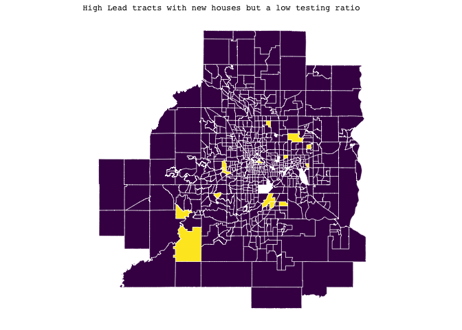<!-- -->

Within our data set, we factor the testing ratio and high lead exposure
and note some interesting patterns with regards to testing ratios. We
see that there seems to be several newer homes in census tracts that are
in the high lead factor but are not getting tested, this may be a result
of ignorance or delayed news. Among the census tracts that have high
testing ratios, areas with relatively older houses are getting tested
more often, which is intuitive as older homes tend to have lead pipes.

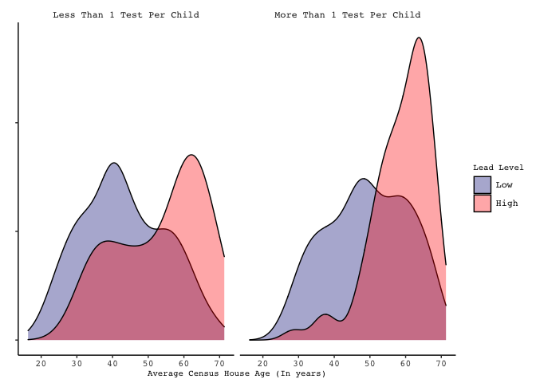<!-- -->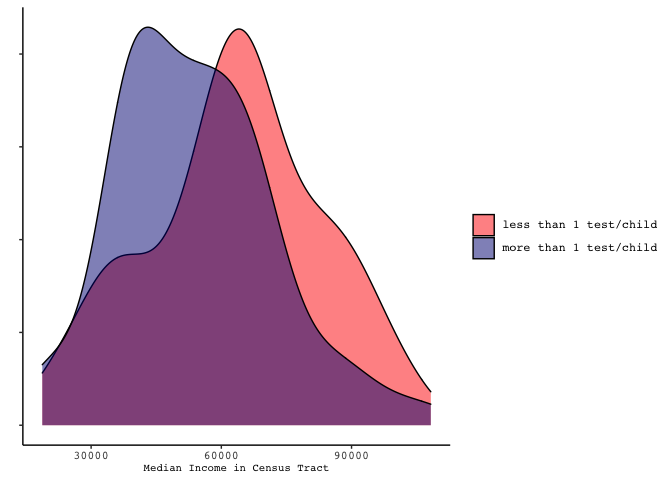<!-- -->

Furthermore, higher income census tracts are getting tested less
compared to lower income census tracts. This is intuitive as lower
income census tracts seem to be at more risk in terms of living in older
houses and thus more exposed to high lead.

## Modeling

In the upcoming section, we will be modeling the binary outcome of
whether a census tract is considered Highlead or not (1% or greater).

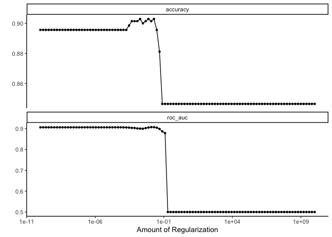<!-- -->

## Lasso

We use a Lasso Logistic Regression to distinguish important variables in
predicting census tracts with high lead concentrations. After tuning for
the best penalty, we discovered that income, proportions of homes built
before 1950, testing ratio, and median age of the census tract are
important variables in modeling the variance of high lead levels.
However, it is difficult to account for spatial correlation, so we will
not be interpreting the output and standard errors. Instead, we will use
the important variables and fit it with a random effect model to account
for spatial correlation. Spatial correlation is very important in our
study as census tracts that are close together will share many similar
characteristics in regards to income, community, etc that will result in
correlated residuals if left unaccounted for.

<!-- -->

    ## # A tibble: 1 × 9
    ##   penalty .metric .estimator  mean     n std_err .config            .best .bound
    ##     <dbl> <chr>   <chr>      <dbl> <int>   <dbl> <chr>              <dbl>  <dbl>
    ## 1  0.0486 roc_auc binary     0.898    10  0.0133 Preprocessor1_Mod… 0.907  0.894

    ## # A tibble: 12 × 3
    ##    term                  estimate penalty
    ##    <chr>                    <dbl>   <dbl>
    ##  1 (Intercept)            -2.09    0.0486
    ##  2 medageE                -0.500   0.0486
    ##  3 medincomeE             -0.211   0.0486
    ##  4 NumHouseE               0       0.0486
    ##  5 PopE                    0       0.0486
    ##  6 propFamilyHouseholds    0       0.0486
    ##  7 propHomesBuiltPre1950   0.556   0.0486
    ##  8 SSIRecpE                0       0.0486
    ##  9 CensusAgeE              0       0.0486
    ## 10 tested                  0.234   0.0486
    ## 11 MarrCoupleChldU3E       0       0.0486
    ## 12 testRatio               0.0711  0.0486

    ## # A tibble: 11 × 2
    ##    var_name              var_imp
    ##    <chr>                   <dbl>
    ##  1 medageE                    78
    ##  2 propHomesBuiltPre1950      78
    ##  3 medincomeE                 72
    ##  4 tested                     72
    ##  5 testRatio                  69
    ##  6 MarrCoupleChldU3E          46
    ##  7 propFamilyHouseholds       43
    ##  8 PopE                       41
    ##  9 NumHouseE                  36
    ## 10 SSIRecpE                   36
    ## 11 CensusAgeE                 20

<!-- -->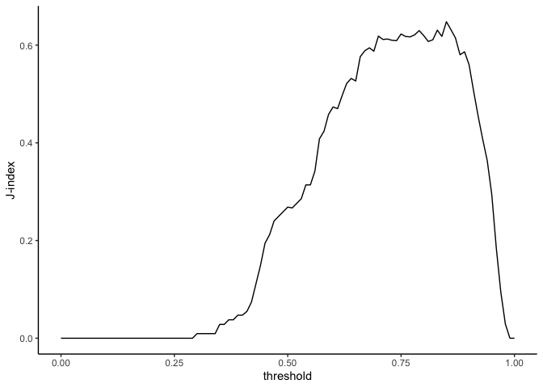<!-- -->

    ## # A tibble: 101 × 4
    ##    .threshold .metric .estimator .estimate
    ##         <dbl> <chr>   <chr>          <dbl>
    ##  1       0.85 j_index binary         0.648
    ##  2       0.86 j_index binary         0.632
    ##  3       0.83 j_index binary         0.631
    ##  4       0.79 j_index binary         0.630
    ##  5       0.75 j_index binary         0.623
    ##  6       0.78 j_index binary         0.621
    ##  7       0.8  j_index binary         0.619
    ##  8       0.7  j_index binary         0.618
    ##  9       0.84 j_index binary         0.618
    ## 10       0.76 j_index binary         0.618
    ## # … with 91 more rows

    ## # A tibble: 3 × 3
    ##   .metric  .estimator .estimate
    ##   <chr>    <chr>          <dbl>
    ## 1 accuracy binary         0.787
    ## 2 sens     binary         0.877
    ## 3 spec     binary         0.771

We note our top variables are median age, proportions of home built
before 1950, median income, and tested. We decide to continue our
analysis by using the testRatio rather than tested variable. testRatio
will be able to consider the number of children that are eligible for
testing while tested is an absolute number. Values of testRatio greater
than 1 suggusts that children are being tested more than once.

## Matern Random Effect Models

We decide to use a random effect model through the the X and Y
coordinates in the centroids. We are able to do so by creating a numeric
factor representing the coordinates of sampled locations. We fit a
constant mu (smoothness parameter) for easier computational purposes.
Because we have the matern correlation coefficient, we do assume
isotropic. We use this model as it is an alternative way to account for
spatial correlation, by imposing a correlation structure on the random
effect so that each census tract are spatially correlated. When two
regions are farther away, we expect the correlation between them to get
lower.

We fit two different models, one with our designated important variables
from lasso and another with an interaction between old homes and income
category. The interaction between proportion of old homes and income
category suggests that income plays a different role among high lead
levels conditioned on proportion of hold homes. Perhaps if we are at a
high income level and have high proportion of old homes, we may see
reduced probability of high lead levels due to the ability to renovate.
As long as rho is not zero, we are accounting for spatial correlation.
Large rho value indicates that regions are farther apart can be
correlated.

Interpretation is the same as every model.

    ## formula: HighLead ~ medincomeE + propHomesBuiltPre1950 + testRatio + medageE + 
    ##     Matern(1 | X + Y)
    ## Estimation of corrPars and lambda by Laplace ML approximation (p_v).
    ## Estimation of fixed effects by Laplace ML approximation (p_v).
    ## Estimation of lambda by 'outer' ML, maximizing p_v.
    ## family: binomial( link = logit ) 
    ##  ------------ Fixed effects (beta) ------------
    ##                       Estimate Cond. SE t-value
    ## (Intercept)            32.4784  20.7119  1.5681
    ## medincomeE             -0.1604   0.1787 -0.8977
    ## propHomesBuiltPre1950   0.2219   0.1022  2.1719
    ## testRatio               6.6685   5.4954  1.2135
    ## medageE                -1.3692   0.7421 -1.8450
    ##  --------------- Random effects ---------------
    ## Family: gaussian( link = identity ) 
    ##                    --- Correlation parameters:
    ##     1.nu    1.rho 
    ##    0.500 6642.954 
    ##            --- Variance parameters ('lambda'):
    ## lambda = var(u) for u ~ Gaussian; 
    ##    X + Y  :  748.2  
    ## # of obs: 690; # of groups: X + Y, 690 
    ##  ------------- Likelihood values  -------------
    ##                         logLik
    ## p_v(h) (marginal L): -142.5096

    ## formula: HighLead ~ IncomeCategory * propHomesBuiltPre1950 + testRatio + 
    ##     medageE + Matern(1 | X + Y)
    ## Estimation of corrPars and lambda by Laplace ML approximation (p_v).
    ## Estimation of fixed effects by Laplace ML approximation (p_v).
    ## Estimation of lambda by 'outer' ML, maximizing p_v.
    ## family: binomial( link = logit ) 
    ##  ------------ Fixed effects (beta) ------------
    ##                                              Estimate Cond. SE  t-value
    ## (Intercept)                                  15.31315  44.8573  0.34137
    ## IncomeCategorylow                           -18.57662  35.1235 -0.52889
    ## IncomeCategorymedhigh                        -7.16378  39.8087 -0.17996
    ## IncomeCategorymedlow                         -6.29450  33.5302 -0.18773
    ## propHomesBuiltPre1950                        -0.04207   2.1893 -0.01922
    ## testRatio                                     8.73074   6.0693  1.43851
    ## medageE                                      -1.02158   0.8532 -1.19728
    ## IncomeCategorylow:propHomesBuiltPre1950       0.59873   2.2074  0.27123
    ## IncomeCategorymedhigh:propHomesBuiltPre1950   0.16059   2.2122  0.07259
    ## IncomeCategorymedlow:propHomesBuiltPre1950    0.16993   2.1977  0.07732
    ##  --------------- Random effects ---------------
    ## Family: gaussian( link = identity ) 
    ##                    --- Correlation parameters:
    ##     1.nu    1.rho 
    ##   0.5000 426.2338 
    ##            --- Variance parameters ('lambda'):
    ## lambda = var(u) for u ~ Gaussian; 
    ##    X + Y  :  1087  
    ## # of obs: 689; # of groups: X + Y, 689 
    ##  ------------- Likelihood values  -------------
    ##                         logLik
    ## p_v(h) (marginal L): -132.7579

Now that we have our two models, we can evaluate them. Note, that we use
a threshold of 70% to predict if a census tract is to be considered in
the high lead category or not. Meaning that if the logistic regression
gives us a probability of .70 or higher, we will have a hard prediction
that the census area is high lead.

The signs of all coefficients make sense, as income increases, the log
odds ratio decreases by -0.16 for every 1000 dollar increase in median
income. This is in check with our understanding as the more income a
household has, the more likely they will be able to remodel and replace
lead pipes. Additionally, the more income a census tract has, the more
newer houses we may see. The proportion of homes built before 1950 seems
to be the most statistically significant coefficient. As per the first
model, a percentage increase in a proportion of homes built before 1950
will increase log odds by .22. The greatest impact in determining high
lead census tracts would be the test ratio. The test ratio is the number
of tests administered within the census tract divided by the number of
children eligible for testing. However, a census tract with exposure to
high lead levels will most likely be testing more often than census
tracts without high levels of exposure.

Our interaction terms in the second model were all non-significant.
Meaning, under the model, income did not impact high lead differently
despite being conditioned on the proportion of houses built before 1950.

Spatial random effect will help improve the prediction because it is
using neighboring information to account for that spatial correlation,
doing so more in the mean structure and actually change the prediction,
conditioned on random effects and getting more precise and improved
conditions, rather than marginal mean prediction. Hence why we have a
100% prediction accuracy for both models, because of the random effect
that is able to capture variations that are unobservant.

    ## # A tibble: 1 × 2
    ## # Groups:   Correct [1]
    ##   Correct     n
    ##   <chr>   <int>
    ## 1 correct   690

    ## # A tibble: 1 × 2
    ## # Groups:   Correct [1]
    ##   Correct     n
    ##   <chr>   <int>
    ## 1 correct   689

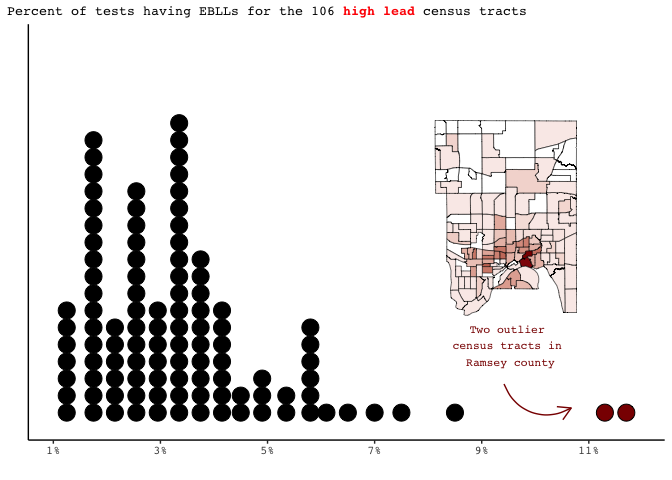<!-- -->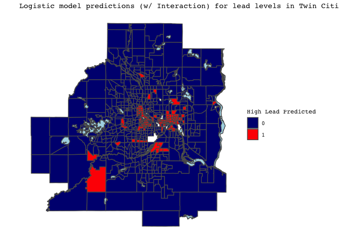<!-- --><!-- -->

# Modeling the percent of children by census tract with EBLLs

Thus far, we have developed a model to predict whether or not a census
tract will have at least 1% of tests return with an indication of EBLLs.
But its important to acknowledge that not all census tracts that we have
denoted as “high lead” have the same proportion of tests indicating
EBLLs. For the 106 “high lead” tracts, the distribution of the
proportion of tests indicating EBLLs is shown below.

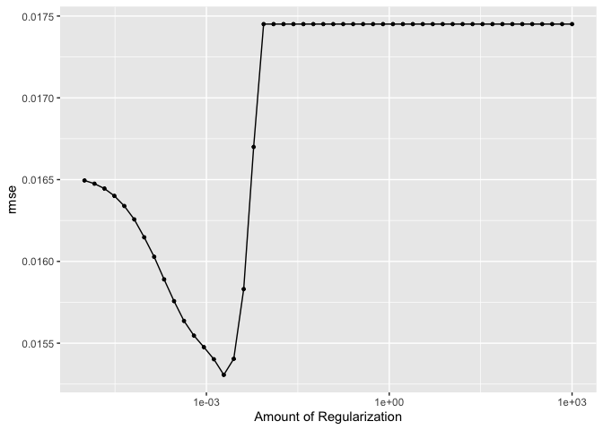<!-- -->

In order to better understand this distribution and what is correlated
with certain tracts having a higher percentage of tests with EBLLs than
others, we will build a model for this percentage using solely the 106
“high lead” tracts. Similar to our logistic model building process to
predict whether or not a tract is “high lead”, we will begin with a
LASSO regression model. Variables that remain in the model after the
shrinkage process can be thought of as most important at helping us
identify why certain tracts have a higher percentage of tests with EBLLs
than others.

Using 10-fold cross validation on our 106 census tracts, the LASSO
modeling process identified tract population, the proportion of homes
built between 1950 and 1969, the proportion of homes built before 1950,
and the estimated mean receipt of supplemental security income (SSI) for
households with children under 18 as the most important predictors of
percentage of tests with EBLLs. Interestingly, population and amount of
SSI both showed a negative relationship with percentage of tests with
EBLLs, meaning more highly populated tracts tend to have a lower
proportion of tests with EBLLs holding other variables constant.
Additionally, tracts receiving more SSI tend to have a lower proportion
of tests with EBLLs holding other variables constant. These
relationships are shown in the plots below.

The reasoning for this phenomena could be that such higher populated and
impoverished tracts are viewed “higher risk” for lead exposure and have
received greater resources to prevent it thus far.

Now that we have our model, we can evaluate it. Looking first at our
prediction errors, the model appears relatively solid with a mean
estimated error of 1.5%. While this is good news, our model must also
have residuals that do not have spatial autocorrelation. Spatial
autocorrelation means residuals in one census tract are related to the
residuals in the census tracts around it, which is problematic because
we violate the assumption of independence of residuals and jeopardize
the validity of hypothesis tests. We can test for spatial
autocorrelation with something called the Moran’s I test. In order to
run the Moran’s I test, we must decide in what way we want to define
census tracts as “close”. In other words, we must define a
**neighborhood structure**. There are many options when defining a
neighborhood structure. We can define tracts as neighbors if they touch
at all, even just at a on point such as a corner. This is called the
Queen neighborhood structure. Another option is the Rook neighborhood
structure, which defines tracts as neighbors if they share an edge (more
than just a corner). Neighbors can also be defined using distance. The
KNN method calculates the distance between the centers (or centroids) of
each census tract, and then defines a neighborhood based on K nearest
tracts, distanced based on the centers (Heggeseth 2022). Because we are
only looking at census tracts with high lead levels, some tracts do not
touch and thus we will use the KNN structure with 4 neighbors. 4
neighbors gives a nice balance between not having too many neighbors
(which makes census tracts almost always correlated) and not having too
few neighbors, making it harder to pick up on spatial correlation. The
KNN(4) structure is shown below.

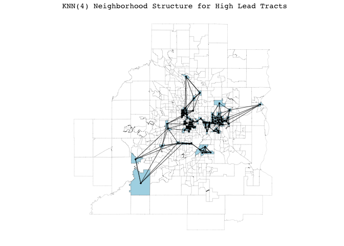<!-- -->

    ## 
    ##  Moran I test under randomisation
    ## 
    ## data:  lasso_results$resid  
    ## weights: Wb    
    ## 
    ## Moran I statistic standard deviate = 4.1422, p-value = 3.44e-05
    ## alternative hypothesis: two.sided
    ## sample estimates:
    ## Moran I statistic       Expectation          Variance 
    ##       0.236081076      -0.009523810       0.003515754

Using the Moran’s I test with the KNN(4) structure shown above, there is
very strong evidence to reject our null hypothesis of no spatial
correlation between neighboring tracts. We thus conclude that census
tracts closer together tend to have similar percentages of tests with
EBLLs than census tracts further apart. Given this, we will need to use
a model that accounts for this spatial autocorrelation. Two models that
can potentially accomplish this are the **simultaneous autoregressive
model (SAR)** and the **conditional autoregressive model (CAR)**. These
models are fit in a similar way to an ordinary least squares model as we
predict percent of tests with EBLLs using our selected variables,
however, we add a component to the model that allows us to use
surrounding neighborhood values at varying weights to estimate
percentage of tests with EBLLs for each tract. After fitting both a CAR
and SAR model using the four variables selected by LASSO and the KNN(4)
neighborhood structure, we compared them using BIC and the Moran’s I
test. From the Moran’s I test we learned the SAR model yielded strong
evidence in support of independent residuals. This evidence was
significantly weaker for the CAR model, implying remaining spatial
autocorrelation in the residuals. The BIC (a criterion for model
selection) was also superior for the SAR model in comparison to the CAR
model, and thus we decided to proceed with the SAR structure. While we
tested multiple other SAR models with different combinations of
explanatory variables, the model with the four variables selected by
LASS0 proved our best model with the lowest average prediction error
(about 1.4%).

While the average predictor error of our model is relatively small at
1.4%, one obvious downfall of this model is that it did not predict any
census tract to have a percent of tests with EBLLs above 5.6%, as seen
below. In reality - as shown in the dotplot earlier in this modeling
section - seven tracts had a percent of tests with EBLLs over 6% and two
tracts had levels over 10%. Thus, our model does not quite capture as
large of a distribution in tract percentages as well as we might have
liked. 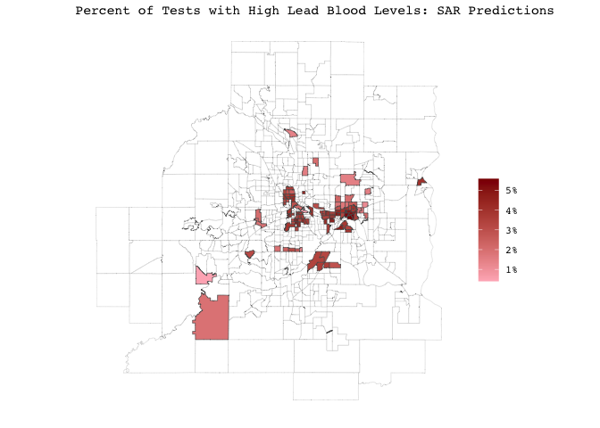<!-- -->

However, our model does indeed do a good job of not systematically over
or under-predicting particular areas of the Twin Cities metropolitan
area. We see that tracts both inside and outside city limits have a mix
of positive and negative residuals and there are several areas where
percent of tests with EBLLs are over predicted in one tract and under
predicted in its neighboring tract. Given the strong evidence that
spatial autocorrelation was accounted for from the Moran’s I test, this
is not surprising.
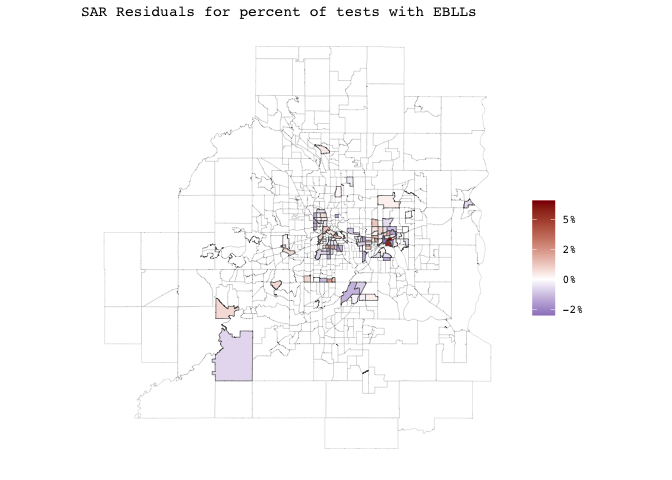<!-- -->

The biggest takeaway from our model is what we can learn about lead
exposure patterns using it. Takeaways are generally similar to the LASSO
regression model we fit, but we now have more certainty in our
coefficient estimates and their significance given we are not breaking
the assumption of independent residuals. The two significant
coefficients in our model are tract population and the proportion of
homes built from 1950 to 1969 in each tract. Both coefficients are
significant on the

level. With regard to population, we estimate for every additional 1000
people residing in a tract that the proportion of tests with EBLLs falls
on average 0.4%, holding other variables constant. Given that census
tracts are intended to have similar populations (ideally \~4000 people),
this might not seem practically significant at first. However, the 106
“high lead” tracts have populations ranging from about 2,000 to over
10,000 people per tract, with the majority falling in the 3000 to 6000
range. Thus, comparing a 6,000 resident to 3,000 resident tract, we’d
expect the 6,000 resident tract to have a percent of tests with EBLLs
about 1.2% lower than that of the 3,000 resident tract, which is a
considerable difference. When looking at our second significant
variable, we learn that with every 10% increase in the proportion of
homes built between 1950 and 1969 we can expect the percent of tests
with EBLLs to fall about *0.4%* (CHECK), holding other variables
constant. This relationship is shown in the graph below on the left and
is rather interesting when contrasted to the graph on the right, which
displays proportion of homes built before 1950 versus percent of tests
with EBLLs for “high lead” tracts. The key takeaway here is that as
tracts tend to have more homes built between 1950-1969, **their percent
of tests with EBLLs tends to fall**, while as tracts tend to have more
homes built prior to 1950 their **percent of tests with EBLLs tends to
rise**. Given that lead paint was not banned in the United States until
1978, this contrasting relationship is incredibly surprising!

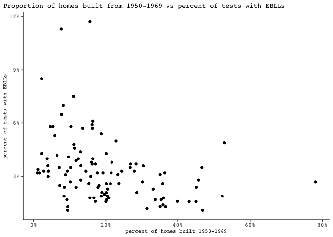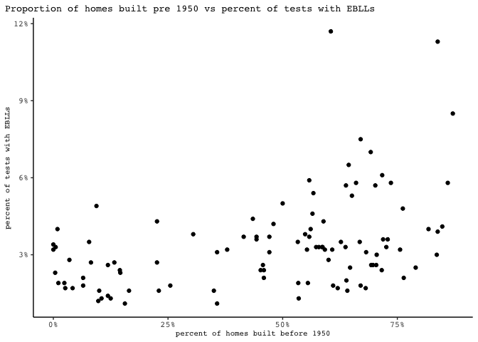

The SSI and proportion of homes built before 1950 variables are both
insignificant in this model, though have coefficient directions that
make intuitive sense given what we have discussed thus far. Holding
other variables constant, as the proportion of homes in a tract built
prior to 1950 increases, the percent of tests with EBLLs in that tract
increases. Additionally, as discussed when interpreting the LASSO model,
tracts receiving more SSI tend to have a lower percentage of tests with
EBLLs holding other variables constant.

# Limitations

One of the main limitations in our analysis was data. While we are
incredibly thankful to have access to public lead data and demographics
on the census tract level, we had been hoping to complete a
spatial-temporal analysis looking at the percent of tests with EBLLs in
each tract each year dating back to the early 2000s. Unfortunately, the
Minnesota Department of Health did not have this data on hand. An
additional goal of our was to look at building-specific data available
through ArcGIS on lead piping for the St. Paul Regional Water Services
(SPRWS) area and incorporate it into our analysis. However, we ran out
of time to learn how to web scrape this and so this will be a task for
the near future. One other limitation related to the data for this
project is that many of the variables we used are estimates. For
example, mean tract age is estimated from ACS and census data. Home
values come from government valuations which is done for tax purposes.
The fact that there is likely a fair amount of error in these estimates
should be taken into account when interpreting model coefficients. Also
related to the topic of modeling is that fact that no neighborhood
structure we choose is going to be perfect. For example, we chose to use
the KNN(4) neighborhood structure for our models, which defines four
neighbors for every tract using distances between tract centroids.
However, it is possible that tracts could be similar in other ways.
Tracts close in distance could be incredibly different due to a highway
running between them, while tracts further apart but both bordering the
river could actually be more similar.

Furthermore, our models will not be the best to predict new data outside
of our dataset. If we have a new census tract added, it will be
difficult to account for the spatial corrrelation. The new observation
may be farther away in distance that it will become indepdent and we
will not gain the extra preditive ability. However, we can use the
distrubitions from the matern random effect models to attempt in making
a prediction for a new area. Unfortunately, we are not able to explain
everything.

# Conclusions

Throughout our research report, we focused on what seems to be
correlated to high lead levels. We anlyzed data from the **7-county Twin
Cities metropolitan area** using public data provided by the **Minnesota
Department of Health** over the period of 2015-2019 (Health, n.d.). We
fit LASSO models to pick out “important” variables and utilize different
spatial correlation regressions to obtain accurate standard errors on
the coefficients.

Overall, the household age and median income of census tracts seem to be
the most important factors when looking at the variation in high lead
levels. This is intuitive as old houses, mentioned earlier, tend to have
older pipes, more dust, paint chips, all of which have a causal effect
leading to high lead levels. Among houses with high lead levels, tract
population and proportions of homes built between 1950-1969 seems to
have lower EBLL comapred to census tracts with more houses built before
1950.

For future research, it might be worthwhile to investigate which census
tracts are getting tested more often than others.

# Acknowledgements

Thank you to our professor Brianna Heggeseth for teaching us the mapping
and modeling techniques used in this analysis, as well as for providing
support and resources throughout this project. We also thank the
Minnesota Department of Health and creators of the tidycensus package
for providing publicly available data that made our work possible.

# References

n.d. *Saint Paul Minnesota*.
<https://www.stpaul.gov/news/saint-paul-announces-145-million-investment-replace-lead-pipes>.

“Annual Elevated Blood Lead Levels.” 2020. *Childhood Lead Exposure:
Annual Blood Lead Levels - MN Data*.
<https://data.web.health.state.mn.us/lead_annual_level>.

“Common Sources of Lead Poisoning.” n.d. *Washington State Department of
Health*.
<https://doh.wa.gov/you-and-your-family/healthy-home/home-contaminants/lead/common-sources-lead-poisoning>.

Health, Minnesota Department of. n.d. *Childhood Lead Exposure Map: MNPH
Data Access - MN Dept. Of Health*.
<https://mndatamaps.web.health.state.mn.us/interactive/leadtract.html>.

Heggeseth, Brianna. 2022. “Correlated Data Notes.” *Brianna C.
Heggeseth*. <https://bcheggeseth.github.io/CorrelatedData/index.html>.

“Lead Poisoning.” 2022. *Mayo Clinic*. Mayo Foundation for Medical
Education; Research.
<https://www.mayoclinic.org/diseases-conditions/lead-poisoning/symptoms-causes/syc-20354717>.

“Prevent Children’s Exposure to Lead.” 2021. *Centers for Disease
Control and Prevention*. Centers for Disease Control; Prevention.
<https://www.cdc.gov/nceh/features/leadpoisoning/index.html>.

Walker, Kyle, and Matt Herman. 2022. *Tidycensus: Load US Census
Boundary and Attribute Data as ’Tidyverse’ and ’Sf’-Ready Data Frames*.
<https://walker-data.com/tidycensus/>.

